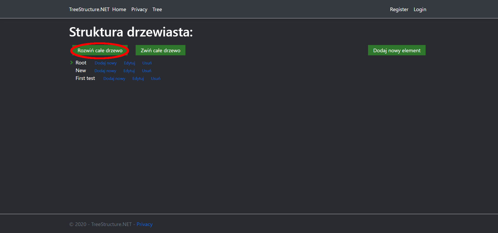
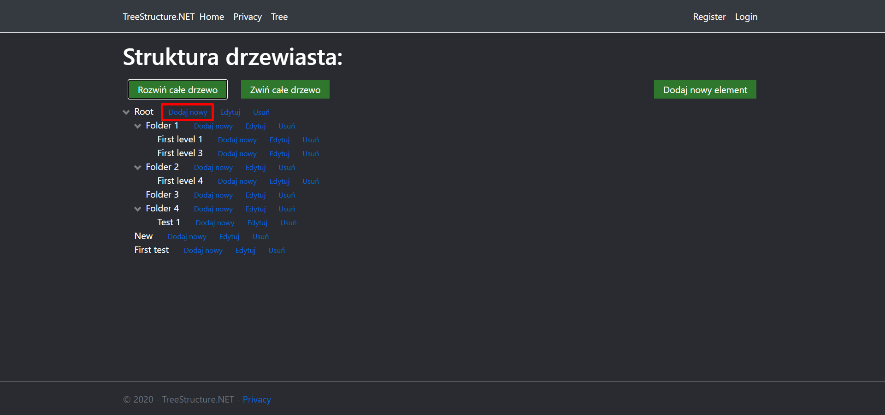
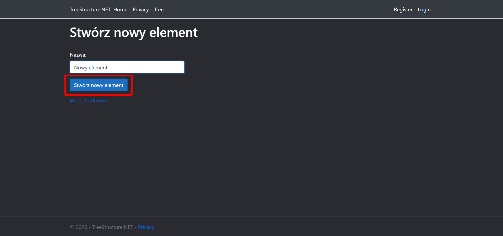
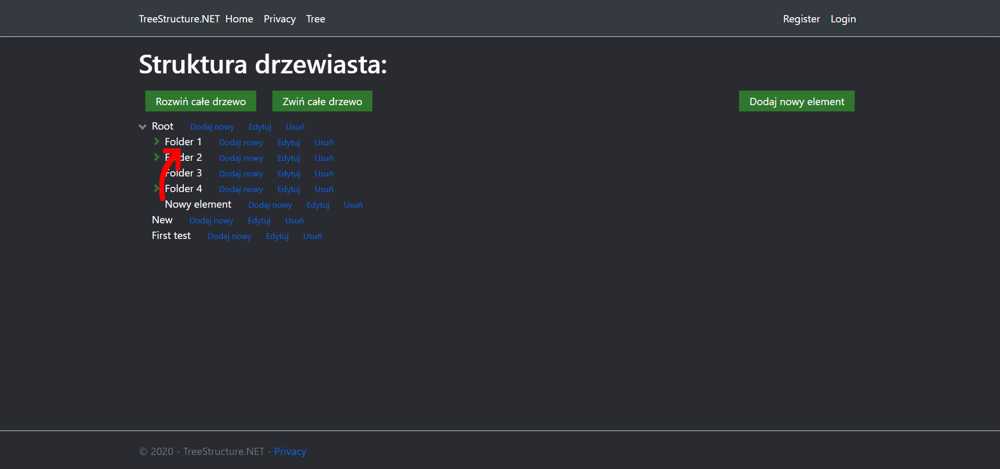
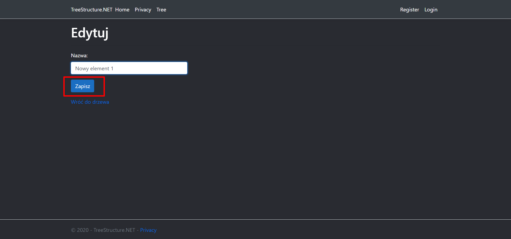
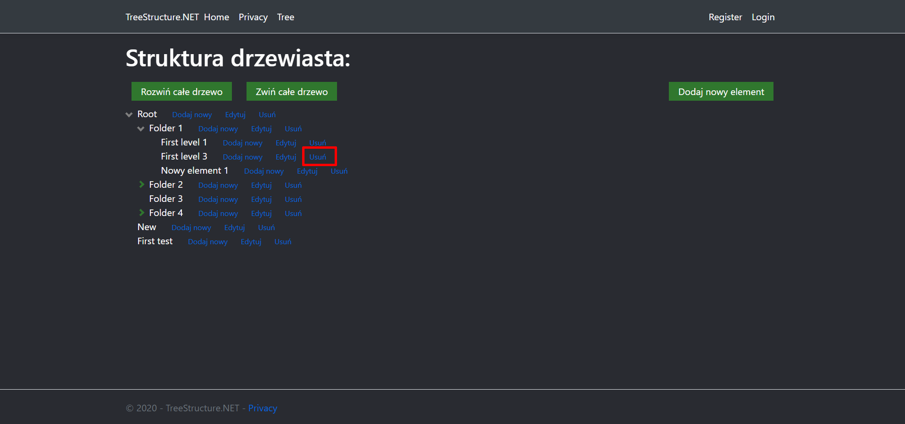
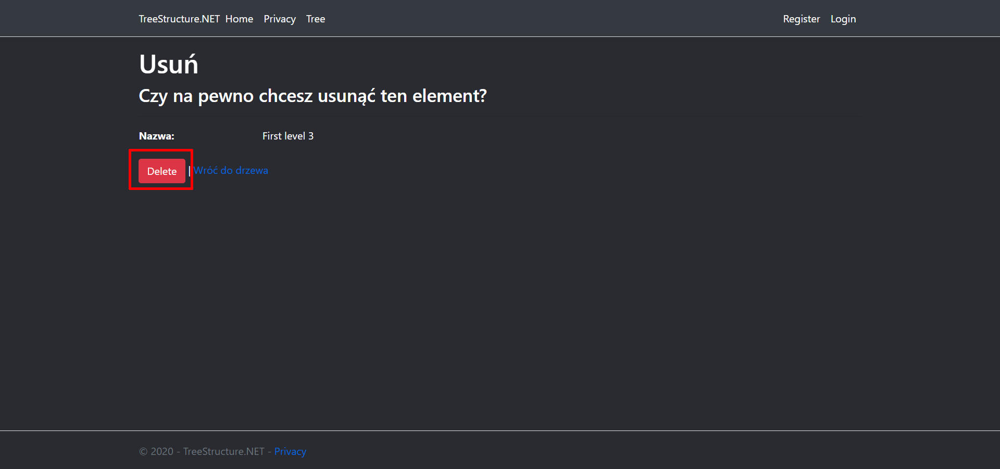
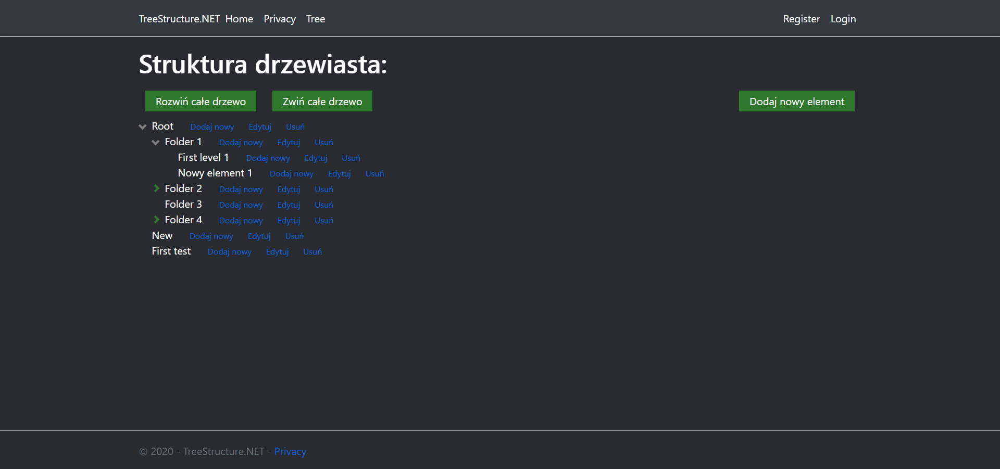

# TreeStructure.NET
Tree structure created with ASP .NET Core MVC.

## Table of contents
* [General info](#general-info)
* [Technologies](#technologies)
* [Setup](#setup)
* [Example](#example)

## General info
The current version of the application only allows you to display the tree structure. Other functions do not work correctly or not at all (will be added soon).

## Technologies
Project is created with:
* ASP .NET Core 3.1
* Visual Studio Community 2019 (IDE)
* LocalDB SQL Server (MSSQL) - Database installed with Visual Studio

## Setup
Download the project to your computer and open it in Visual Studio 2019. 
### Migration
Before starting the application, you must perform the first migration to the database. From the Tools menu, choose NuGet Package Manager> Package Manager Console (PMC) (If you want to change the database, you must configure the appsettings.json file and install the appropriate NuGet packages).  
In the PMC, enter the following commands:
``` PowerShell
Add-Migration InitialCreate
Update-Database
```
Wait for the migration to complete
### Starting up
In Visual Studio, from the Debug menu, choose Run without debug (or press Ctrl + F5)

## Example
  
  
  
  
  
  
  
  
  
